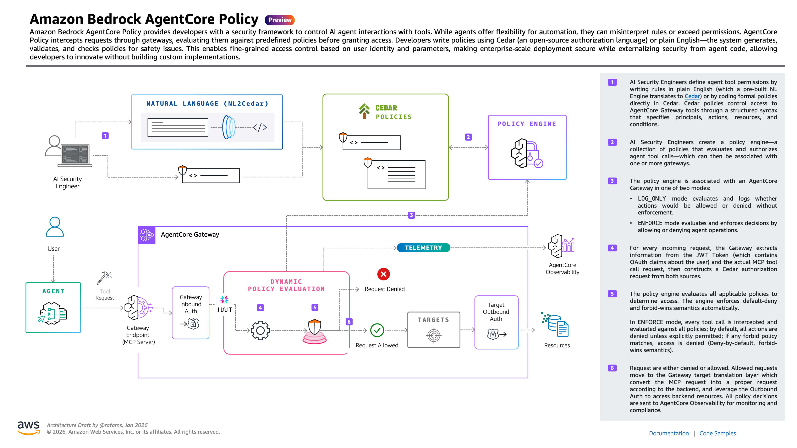

# AgentCore Experimental CDK L2 Constructs


Experimental CDK Construct Library for Amazon Bedrock AgentCore using Custom Resources.

⚠️ **For quick experimentation, Not for production use.** Breaking changes expected when official L1 constructs are released and abstraction is re-implemented in `@aws-cdk/aws-bedrock-agentcore-alpha`.

## Overview

This library provides experimental CDK constructs for Amazon Bedrock AgentCore services, including:

- **Policy Engine**: Define and manage Cedar-based authorization policies
- **Cedar Policy Builder**: Fluent API for creating Cedar policy statements
- **Evaluations**:  Monitor and evaluate agent interactions in real-time

## AgentCore Policy

### Policy Engines

A **Policy Engine** is a centralized authorization service that evaluates Cedar-based policies to make access control decisions for Amazon Bedrock AgentCore resources. Policy engines act as the governance layer between users and AI tools, ensuring that only authorized actions are permitted based on your organization's security requirements.

Key characteristics:

- **Centralized Authorization**: Single point of control for access decisions across multiple gateways and tools
- **Cedar Policy Language**: Uses Amazon's Cedar policy language for expressive, human-readable authorization rules
- **Real-time Evaluation**: Policies are evaluated in real-time during tool invocation requests

### Policies

**Policies** are individual Cedar-based authorization rules that define who can perform what actions on which resources under specific conditions. Each policy is associated with a policy engine and contains the business logic for access control decisions.

Policy components:

- **Principal**: Who is making the request (OAuth users, etc.)
- **Action**: What operation is being requested (tool invocation, etc.)
- **Resource**: What resource is being accessed (gateways, etc.)
- **Conditions**: When the policy applies (context-dependent rules)

Policies support both `PERMIT` and `FORBID` effects, with optional `when` and `unless` conditions for fine-grained control. The Cedar analyzer validates policies against your schema to ensure correctness and prevent authorization bypasses.



## AgentCore Evaluations


⚠️ **Components not yet exported.** AgentCore Evaluations constructs are currently under active development and not available for use.

### Online Evaluations

**Online Evaluations** provide real-time monitoring and assessment of agent interactions, allowing you to continuously evaluate the quality, safety, and performance of your AI agents in production environments.

Key capabilities:

- **Real-time Monitoring**: Evaluate agent responses as they happen
- **Custom Evaluators**: Define specific criteria for assessment
- **Sampling Configuration**: Control evaluation frequency and scope
- **Performance Metrics**: Track agent effectiveness over time

### Evaluators

**Evaluators** are assessment components that apply specific criteria to evaluate agent interactions. They can assess various aspects such as response quality, safety, relevance, and adherence to guidelines.

Evaluator types:

- **Built-in Evaluators**: Pre-configured assessment criteria
- **Custom Evaluators**: User-defined evaluation logic with custom defined instructions, model, etc.

_Note: Evaluation constructs will be exported in a future release when the implementation is complete._

## Documentation

📄 [Complete API Documentation](./API.md)

## Installation

```bash
npm install agentcore-experimental-constructs
```

## Usage Examples

For a complete example, see [test](./test) folder

```typescript
import { App, CfnOutput, Stack, StackProps } from 'aws-cdk-lib';
import { Function, Runtime, Code } from 'aws-cdk-lib/aws-lambda';
import { Construct } from 'constructs';
import {
  CedarPolicy,
  CedarAction,
  CedarEffect,
  CedarPrincipal,
  CedarResource,
  PolicyEngine,
  ValidationMode,
} from 'agentcore-experimental-constructs';
import { Gateway, ToolSchema } from '@aws-cdk/aws-bedrock-agentcore-alpha';
import * as path from 'path';

export class MyStack extends Stack {
  constructor(scope: Construct, id: string, props: StackProps = {}) {
    super(scope, id, props);

    const gateway = new Gateway(this, 'Gateway', {
      gatewayName: 'test-gateway',
      description: 'Test gateway',
    });

    const lambda = new Function(this, 'Lambda', {
      runtime: Runtime.NODEJS_20_X,
      handler: 'index.handler',
      code: Code.fromAsset('lambda'),
    });

    const lambdaTarget = gateway.addLambdaTarget('lambda', {
      gatewayTargetName: 'weather-lambda',
      lambdaFunction: lambda,
      toolSchema: ToolSchema.fromLocalAsset(path.join(__dirname, 'lambda', 'lambda_tool_schema.json')),
    });

    const engine = new PolicyEngine(this, 'PolicyEngine', {
      name: 'test_policy_engine',
      description: 'Test policy engine',
    });

    engine.addPolicy({
      name: 'test_policy',
      description: 'Test policy',
      policyDefinition: CedarPolicy.fromPolicyStatement({
        effect: CedarEffect.PERMIT,
        principal: CedarPrincipal.anyOAuthUser(),
        action: CedarAction.specificTool(lambdaTarget, 'getWeather'),
        resource: CedarResource.gateway(gateway),
        when: ['principal.hasTag("username")'],
        unless: ['context.input.city == "London"'],
      }),
      validationMode: ValidationMode.IGNORE_ALL_FINDINGS,
    });

    new CfnOutput(this, 'GatewayArn', { value: gateway.gatewayArn });
    new CfnOutput(this, 'GatewayUrl', { value: gateway.gatewayUrl! });
    new CfnOutput(this, 'EngineArn', { value: engine.policyEngineArn });
    new CfnOutput(this, 'EngineId', { value: engine.policyEngineId });
  }
}

const devEnv = {
  account: process.env.CDK_DEFAULT_ACCOUNT,
  region: 'us-east-1',
};

const app = new App();
new MyStack(app, 'agentcore-policy-dev', { env: devEnv });
app.synth();
```

## Limitations

- **Experimental**: API may change without notice
- **Custom Resources**: Uses CloudFormation custom resources for AWS API calls
- **Region Support**: Limited to regions where AgentCore is available
- **Breaking Changes**: Expected when official L1 constructs are released

## Contributing

This is an experimental library. Contributions are welcome but expect significant changes as the official CDK constructs become available.

## License

Apache 2.0
